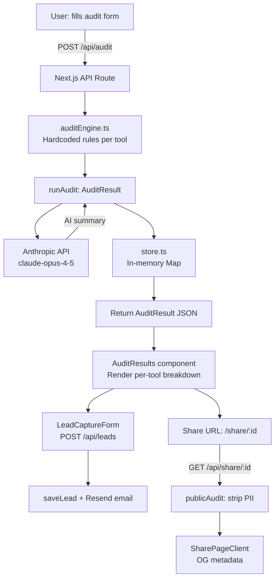

# Architecture — SpendLens

## System Diagram

## Data Flow: Input → Audit Result

1. User fills `AuditFormData` (tools[], teamSize, useCase) in the browser.
2. Form state is persisted to `localStorage` on every keystroke.
3. On submit, `POST /api/audit` sends the JSON body to the Next.js API route.
4. `runAudit(formData)` maps each `ToolEntry` to a `ToolRecommendation` using per-tool audit functions. Logic is pure TypeScript — no AI, deterministic, testable.
5. `generateAISummary()` calls Anthropic with a structured prompt. On failure (network, 429, missing key) it falls back to a templated string — the audit result is never blocked by AI availability.
6. The full `AuditResult` is saved to the in-memory store keyed by `nanoid(10)`.
7. The result is returned and rendered client-side. The share URL `/share/:id` fetches via `GET /api/share/:id`, which strips PII before returning.

## Stack Choices

| Layer | Choice | Reason |
|---|---|---|
| Framework | Next.js 14 App Router | Server API routes needed to hide Anthropic key; OG metadata per share URL requires SSR; Vercel deploy is 1 command |
| Language | TypeScript | Type safety on the audit engine prevents silent bugs in savings calculations |
| Styling | Plain CSS (custom design system) | No Tailwind compiler needed for artifact; full control over the aesthetic; smaller bundle |
| AI | Anthropic SDK (`claude-opus-4-5`) | Assignment preference; best reasoning quality for financial summaries |
| Email | Resend | Generous free tier (100/day); clean API; works with `@next/` environment |
| Storage | In-memory Map | Zero-config for v1; abstracted behind `store.ts` for easy swap |
| Auth/abuse | Honeypot + IP rate limit | Frictionless for users; sufficient for MVP scale |
| ID generation | `nanoid(10)` | URL-safe, short, collision probability negligible at MVP scale |

## Scaling to 10k Audits/Day

The in-memory store is the only component that breaks at scale — it's stateless across restarts and doesn't survive multiple instances. The fix is a single-file swap in `store.ts`:

- **Storage:** Supabase (Postgres) — `audits` and `leads` tables, indexed by `id`. The `AuditResult` JSON fits in a single `jsonb` column.
- **Caching:** Add `Redis` (Upstash free tier) to cache audit results for share URLs — avoids hitting Postgres on every share page load.
- **Rate limiting:** Move IP rate limiting to Vercel Edge Middleware with a Redis counter — more reliable than in-process Maps across instances.
- **Anthropic API:** At 10k audits/day, add a queue (e.g., Inngest) to avoid bursting the Anthropic rate limit. Audit math returns immediately; AI summary arrives via polling or WebSocket.
- **Email:** Resend scales to this volume on a paid plan. No architectural change needed.

Everything else (audit engine, UI, share pages) is stateless and scales horizontally with Vercel's edge network.
